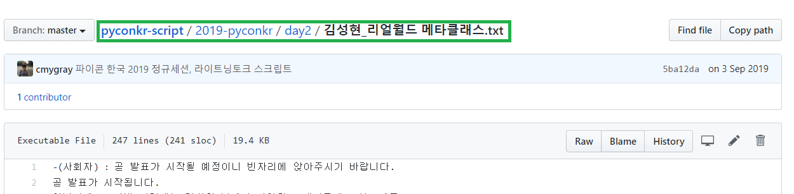
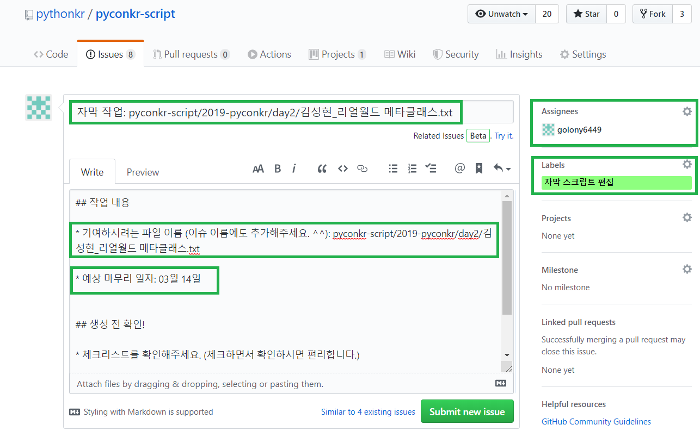

## 작업 내용

* 기여하시려는 파일 이름 (이슈 이름에도 추가해주세요. ^^):

* 예상 마무리 일자: 00월 00일

## 생성 전 확인!

* 체크리스트를 확인해주세요. (체크하면서 확인하시면 편리합니다.)

- [ ] 이슈 제목은 작업하려는 파일 이름으로 작성하셨나요?
- [ ]  `assignee`를 자신으로 할당 하셨나요?
- [ ]  `자막 스크립트 편집` 라벨이 추가되어있나요?

## 예시

* 아래의 스크린샷을 참고해주세요.

