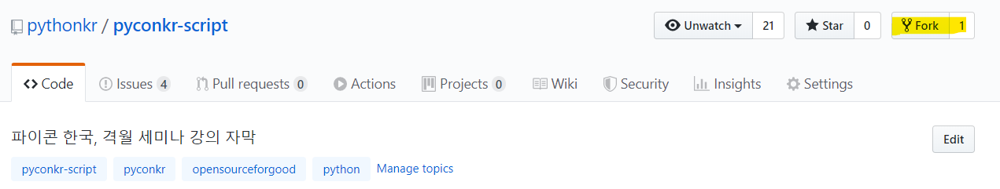
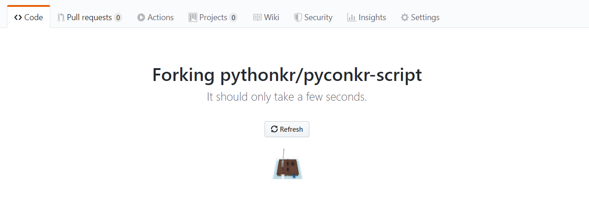
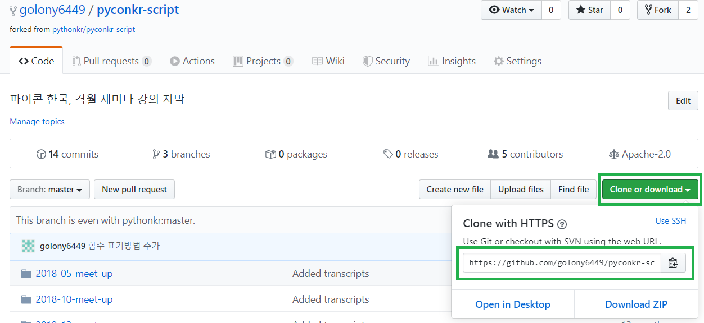
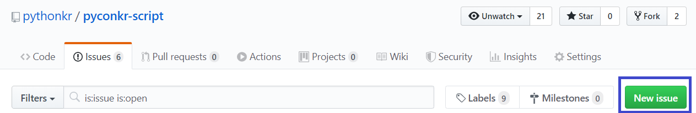
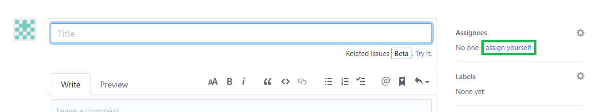
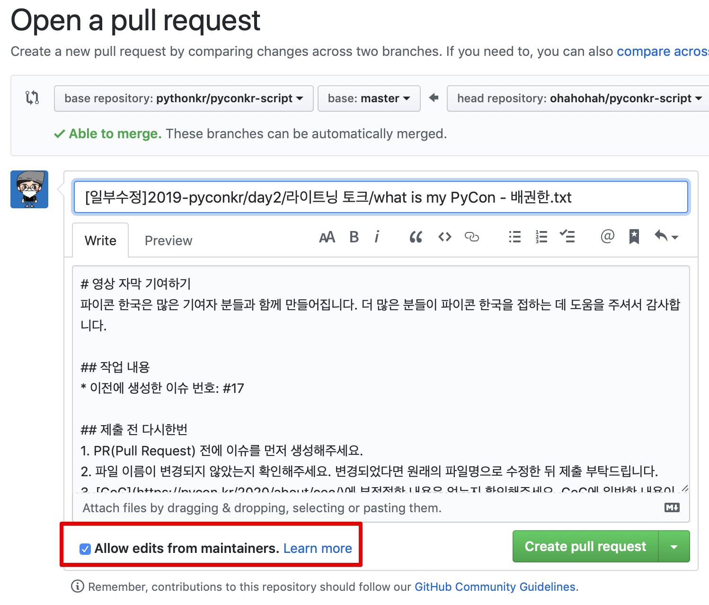

멋진 파이써니스타 여러분! 프로젝트에 기여해주셔서 감사합니다.:tada: 파이콘 한국은 파이썬 커뮤니티의 많은 분들의 자발적인 도움으로 만들어가고 있습니다.:+1:

- [사전 준비](#%EC%82%AC%EC%A0%84-%EC%A4%80%EB%B9%84)
    - [1. 저장소\(Repository\) 준비](#1-%EC%A0%80%EC%9E%A5%EC%86%8Crepository-%EC%A4%80%EB%B9%84)
    - [2. 작업 전 issue 생성](#2-%EC%9E%91%EC%97%85-%EC%A0%84-issue-%EC%83%9D%EC%84%B1)
- [스크립트 편집](#%EC%8A%A4%ED%81%AC%EB%A6%BD%ED%8A%B8-%ED%8E%B8%EC%A7%91)
- [Pull Request하는 방법](#Pull-Request하는-방법)
    - [PR 전 확인해주세요](#pr-%EC%A0%84-%ED%99%95%EC%9D%B8%ED%95%B4%EC%A3%BC%EC%84%B8%EC%9A%94)
    - [모든 PR은](#%EB%AA%A8%EB%93%A0-pr%EC%9D%80)
    - [자막 스크립트 편집 PR](#%EC%9E%90%EB%A7%89-%EC%8A%A4%ED%81%AC%EB%A6%BD%ED%8A%B8-%ED%8E%B8%EC%A7%91-pr)
        - [스크립트 일부만 편집했을 때](#%EC%8A%A4%ED%81%AC%EB%A6%BD%ED%8A%B8-%EC%9D%BC%EB%B6%80%EB%A7%8C-%ED%8E%B8%EC%A7%91%ED%96%88%EC%9D%84-%EB%95%8C)
        - [스크립트 전체 편집이 완료되었을 때](#%EC%8A%A4%ED%81%AC%EB%A6%BD%ED%8A%B8-%EC%A0%84%EC%B2%B4-%ED%8E%B8%EC%A7%91%EC%9D%B4-%EC%99%84%EB%A3%8C%EB%90%98%EC%97%88%EC%9D%84-%EB%95%8C)

---
## 사전 준비
### 1. 저장소(Repository) 준비
- 저장소 준비 전, `git-cli` [설치](https://git-scm.com/)와 자신의 github 계정으로 로그인 과정이 필요합니다.

1. 저장소를 포크(fork) 해주세요.  
  

- 잠시만 기다리시면 로그인한 계정으로 저장소가 포크됩니다.  
  
  
2. 포크된 자신의 저장소 주소를 확인합니다.  
  
  
3. 명령 프롬프트 등의 터미널을 실행한 뒤, 저장소를 복사할 디렉토리로 이동해주세요.  
   - `Shift + 우클릭` -> `여기에 명령창 실행` 을 사용하시면 편리합니다.  
  
4. 아래 명령어를 순서대로 입력해주세요.   
   - (`<주소>`는 알맞은 주소를 입력하신 뒤, 주석 부분은 제외하고 입력해주세요.)  
   - 예시: `git clone https://github.com/계정명/......`  
  
```powershell
git clone <주소>              # 복사(clone) 명령
```

### 2. 작업 전 issue 생성  
- 중복작업과 충돌(conflict) 방지를 위해 이슈를 생성하고, `assignee`를 자신으로 설정해주세요.  
- 이슈는 원래의 저장소인 [pyconkr의 script 저장소](https://github.com/pythonkr/pyconkr-script)에 생성해주시면 됩니다.  

1. `pycon/pycon-script` 저장소에서 새로운 이슈를 생성합니다.  
  

2. `assign yourself`를 클릭하시면 자신을 `assignee`로 추가할 수 있습니다.  
  

3. 제목 등 필요한 내용을 기입하신 뒤 `Submit new issue`를 눌러주세요.  
  
  
기여를 위한 사전작업이 완료되었습니다. 컴퓨터에 생성된 `*.md` 파일을 수정해주시면 됩니다.  
커밋 후 PR(Pull Request)를 보내주시면 빠르게 반영하겠습니다.  

---
## 스크립트 편집
- 스크립트의 일부만 편집해 기여하는 것도 가능합니다. 
- **오타 등을 제외하고는 발화 내용을 교정 및 편집하지 않도록 합니다.** 
  - 세션 내용에 대한 의견은 영상의 댓글로 남겨주세요.

1. 오,탈자 수정하기
- 개발 용어는 영문으로 표기합니다.
    - 보다 자세한 표기에 대해서는 [자막 용어집](https://github.com/pythonkr/python-terms)을 참조해주세요. 대표어로 표기하면 됩니다.
- \*, - 이나 발표자명이 발화 내용 앞에 적혀있을 경우 삭제합니다.
    - e.g., - 이것은 말이죠 / - 강종구 : 이 부분에서...
- 통일된 표기법을 위해 [표기법 문서](https://github.com/pythonkr/pyconkr-script/blob/master/subtitle-notation.md)를 참고해주세요.

2. 스크립트의 문단과 행을 슬라이드 구간에 맞춰서 분리하기
- 자막 작업 시 복사, 붙여넣기가 편하도록 문장을 나누고 공백열을 추가합니다.
- 하나의 자막에서 최고 줄 수 : 2줄
- 하나의 자막에서 최고 줄 길이 : 21 한국어 글자
- 줄 바꾸기에서 언어적 단위를 자르지 말 것 (형용사구, 명사구, 절 등. 또한 끝문장과 시작 문장을 같이 넣지 말 것)
- 자막 구조를 위해 한 문장의 끝부분과 다른 문장의 시작 부분을 한 자막에 합쳐 넣지 말 것
- 텍스트 자르기 : 읽기 속도나 길이를 위해서 필요하지 않다면 문장을 너무 짧게 자르지 말 것 (한국어 글자가 14자 정도 이하면 너무 짧음)
- 강연이 아닌 소리 재현을 하려면 소괄호 안에 넣을 것
- 화면에 뜨는 텍스트는 대괄호 `[]` 에 넣을 것

---
## Pull Request하는 방법
- PR(Pull Request)을 처음해보신다면 [첫 기여하기](https://github.com/firstcontributions/first-contributions/blob/master/translations/README.ko.md)와 [Github Guide - Creating a pull request](https://help.github.com/en/github/collaborating-with-issues-and-pull-requests/creating-a-pull-request)를 참고해보세요 :)  
- PR 한 후에 Maintainer가 리뷰한 후 내용 수정을 요청할 수 있습니다. (참고.[PR을 업데이트 하는 방법](https://pandas-docs.github.io/pandas-docs-travis/development/contributing.html#updating-your-pull-request))

### PR 전 확인해주세요 
- PR 관련한 [issue를 먼저 생성](./preparation.md#2-작업-전-issue-생성)해주세요.
- 중복된 PR 이 없는지 확인해주세요.
- 작업파일명은 repository의 파일명은 같게 해주세요.

### 모든 PR은
- PR 내용에는 `#이슈 번호` 를 포함해 적어주세요. 
- Maintainer가 수정할 수 있도록 `Allow edits from maintainers` 항목을 체크해주세요. 


### 자막 스크립트 편집 PR
- 작업할 수 있는 만큼만 편집해주시면 됩니다. **어디서부터 어디까지 편집했는지 꼭 파일에 적어주세요.**
- [참고: 스크립트 편집 기준](https://github.com/pythonkr/pyconkr-script#스크립트-편집)

#### 스크립트 일부만 편집했을 때 
- 편집한 스크립트 내용 앞에 줄을 추가해 `(여기부터 검수 시작)` 을 적어주시고 검수한 내용 마지막 줄에 `(여기까지 검수 완료)`를 추가해 적어주세요.
- PR 제목은 `[일부수정]파일 경로포함 파일명` 으로 합니다. 
(예. `[일부수정]2019-pyconkr/day2/라이트닝 토크/what is my PyCon - 배권한.txt`)

#### 스크립트 전체 편집이 완료되었을 때

- 모든 내용이 검수 완료된 스크립트는 마지막 줄에 `(검수완료)` 라고 적어주세요.
- PR 제목은 `[전체 편집]파일 경로포함 파일명` 으로 합니다. 
(예. `[전체편집]2019-pyconkr/day2/라이트닝 토크/what is my PyCon - 배권한.txt`)

---
참고자료. 
- [첫 기여하기 by firstcontributions](https://github.com/firstcontributions/first-contributions/blob/master/translations/README.ko.md)
- [Github Guide - Creating a pull request](https://help.github.com/en/github/collaborating-with-issues-and-pull-requests/creating-a-pull-request)
- [pandas - contributing guide](https://pandas-docs.github.io/pandas-docs-travis/development/contributing.html#updating-your-pull-request)
